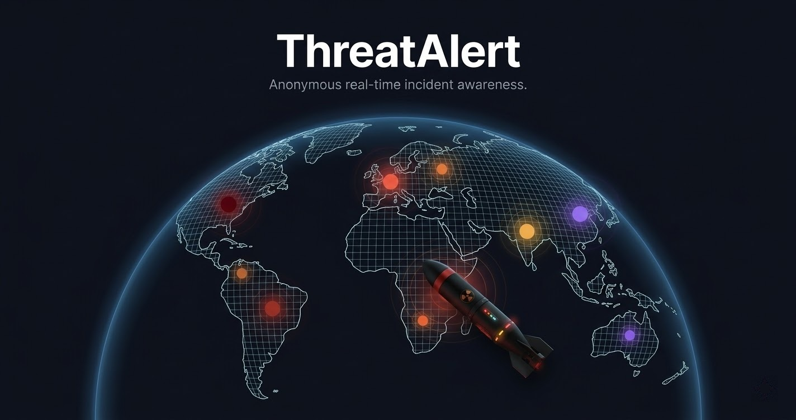
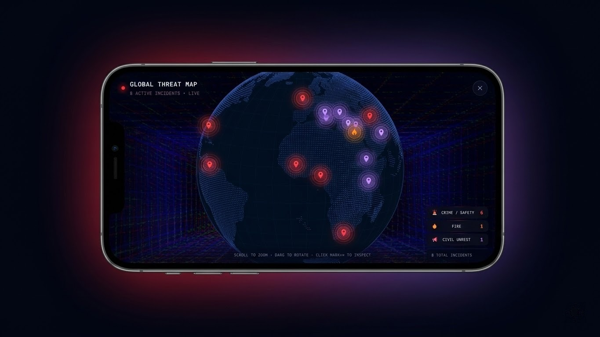

<div align="center">


# ThreatAlert

**Anonymous, community-driven real-time incident awareness — on a living map.**

[](https://nextjs.org)
[](https://firebase.google.com)
[](https://typescriptlang.org)
[](https://tailwindcss.com)
[](https://web.dev/progressive-web-apps/)
[](LICENSE)

<br/>



<br/>

[🌐 Live Demo](https://threatalert.live) · [📸 Screenshots](#screenshots) · [🚀 Self-host](#getting-started) · [🤝 Contribute](#contributing)

</div>

---

> **ThreatAlert** is a zero-auth, privacy-first PWA where anyone can pin an incident — crime, fire, disaster, civil unrest, or infrastructure failure — on a shared live map, and the community votes on it to verify or resolve it. No sign-up. No tracking. Just signal.

---

## ✨ Features at a Glance

| | Feature | Details |
|--|---------|---------|
| 🗺️ | **Live Incident Map** | Leaflet-powered map with dark & light tile sets, animated category pins, and a pulsing user-location dot |
| 📍 | **One-tap Reporting** | FAB button, long-press anywhere on the map, or tap-to-place a pin — then pick a category, write a description, and attach up to 3 photos |
| 🗳️ | **Community Voting** | Confirm · Resolve · Flag — votes gate incidents from `pending → active` using per-category thresholds; duplicate votes are blocked server-side |
| 🔔 | **Push Notifications** | Browser push (FCM) with a configurable radius (1 / 5 / 10 / 25 km or worldwide) and minimum-vote threshold |
| 🌐 | **3D Globe Gallery** | Drag-to-rotate D3.js globe showing every live incident as a glowing dot — tap any dot to open the full detail |
| 📰 | **Incident Ticker** | Scrollable strip of active incidents at the bottom of the screen — tap to fly the map to any of them |
| 🔗 | **Deep-link Sharing** | Every incident gets a shareable URL that opens the app, flies to the map location, and shows the detail sheet |
| 📲 | **Installable PWA** | Runs standalone on iOS & Android with a home-screen icon and app shortcut for quick reporting |
| 🌙 | **Dark / Light Theme** | System-aware with manual override; map tiles, UI, and globe all switch together |
| 🔒 | **Privacy-first** | Fully anonymous — no accounts, IPs are one-way HMAC-hashed before storage and never logged raw |
| ⏱️ | **Auto-expiry** | Incidents expire automatically based on category (e.g. Crime: 4 h · Fire: 6 h · Disaster: 12 h) |
| 🛡️ | **Rate limiting** | 5 reports per IP per hour, enforced at the Cloud Functions layer |

---


## 📸 Screenshots

<p align="center">
  
</p>


---

## 🗂️ Incident Categories

Each category has its own colour-coded pin, icon, vote threshold, and time-to-live:

| Icon | Category | TTL | Votes to activate |
|------|----------|-----|-------------------|
| 🛡️ | **Crime / Safety** | 4 h | 3 |
| ⛈️ | **Natural Disaster** | 12 h | 2 |
| 🔥 | **Fire** | 6 h | 2 |
| 🚧 | **Infrastructure** | 8 h | 3 |
| 📢 | **Civil Unrest** | 6 h | 4 |
| ⚠️ | **Other** | 4 h | 5 |

---

## 🏗️ Architecture

```
┌─────────────────────────────────────────────┐
│               Browser / PWA                 │
│  Next.js 16 · React 19 · Tailwind v4        │
│                                             │
│  MapView (Leaflet)                          │
│  IncidentGlobeGallery (D3.js canvas globe)  │
│  ReportSheet ──────────────────────┐        │
│  IncidentDetailSheet               │        │
│  NotificationSheet                 │        │
└────────────────────────────────────┼────────┘
                    REST / Firestore  │  FCM push
┌───────────────────────────────────────────────┐
│           Firebase                             │
│                                               │
│  Cloud Functions (Node 20, us-east1)          │
│    POST /api/createIncident  ← rate-limit+    │
│    POST /api/voteIncident    ← dedup by IP    │
│    POST /api/subscribeToAlerts               │
│    POST /api/unsubscribeFromAlerts           │
│                                               │
│  Firestore   — incidents collection           │
│  Storage     — photo uploads                  │
│  FCM         — push notification delivery     │
└───────────────────────────────────────────────┘
```

- **Writes** always go through Cloud Functions (rate-limited, IP-hashed).  
- **Reads** are direct Firestore `onSnapshot` streams — the map updates in real time without polling.
- In development with no `NEXT_PUBLIC_FUNCTIONS_URL`, the app falls back to direct Firestore writes for easier local testing.

---

## 🚀 Getting Started

### Prerequisites

- Node.js 20+
- A [Firebase](https://firebase.google.com) project with Firestore, Storage, and Cloud Messaging enabled
- Firebase CLI: `npm i -g firebase-tools`

### 1. Clone & install

```bash
git clone https://github.com/BaselAshraf81/threatalert.git
cd threatalert
npm install
```

### 2. Configure environment

```bash
cp .env.local.example .env.local
```

Open `.env.local` and fill in your Firebase project values (find them at **Firebase Console → Project Settings → Your apps**):

```env
NEXT_PUBLIC_FIREBASE_API_KEY=
NEXT_PUBLIC_FIREBASE_AUTH_DOMAIN=
NEXT_PUBLIC_FIREBASE_PROJECT_ID=
NEXT_PUBLIC_FIREBASE_STORAGE_BUCKET=
NEXT_PUBLIC_FIREBASE_MESSAGING_SENDER_ID=
NEXT_PUBLIC_FIREBASE_APP_ID=

# VAPID key for Web Push — Firebase Console → Cloud Messaging → Web Push certificates
NEXT_PUBLIC_FIREBASE_VAPID_KEY=

# Salt for one-way IP hashing (never stored raw)
# Generate: node -e "console.log(require('crypto').randomBytes(32).toString('hex'))"
IP_HASH_SALT=

ALLOWED_ORIGIN=http://localhost:3000
```

### 3. Set up Firestore security rules

```bash
firebase deploy --only firestore:rules
```

### 4. Deploy Cloud Functions

```bash
cd functions && npm install && cd ..
firebase deploy --only functions
```

### 5. Run locally

```bash
npm run dev
```

Open [http://localhost:3000](http://localhost:3000). The dev server auto-generates the Firebase Messaging service worker before starting.

---

## 🌍 Deploying to Production

ThreatAlert ships with configs for both **Firebase Hosting** and **Netlify**.

### Firebase Hosting

```bash
npm run build
firebase deploy
```

### Netlify

Push to your repo — `netlify.toml` handles the build command and publish directory automatically.

> Don't forget to set all `NEXT_PUBLIC_*` environment variables in your hosting provider's dashboard, and set `ALLOWED_ORIGIN` to your production domain.

---

## ⚙️ Configuration Reference

| Variable | Required | Description |
|----------|----------|-------------|
| `NEXT_PUBLIC_FIREBASE_API_KEY` | ✅ | Firebase web API key |
| `NEXT_PUBLIC_FIREBASE_AUTH_DOMAIN` | ✅ | Firebase Auth domain |
| `NEXT_PUBLIC_FIREBASE_PROJECT_ID` | ✅ | Firestore project ID |
| `NEXT_PUBLIC_FIREBASE_STORAGE_BUCKET` | ✅ | Firebase Storage bucket |
| `NEXT_PUBLIC_FIREBASE_MESSAGING_SENDER_ID` | ✅ | FCM sender ID |
| `NEXT_PUBLIC_FIREBASE_APP_ID` | ✅ | Firebase App ID |
| `NEXT_PUBLIC_FIREBASE_VAPID_KEY` | ✅ | VAPID key for push notifications |
| `IP_HASH_SALT` | ✅ | Secret for HMAC IP hashing |
| `ALLOWED_ORIGIN` | ✅ | CORS origin for Cloud Functions |
| `NEXT_PUBLIC_FUNCTIONS_URL` | Optional | Emulator URL for local function testing |

---

## 🔒 Privacy & Security

- **No accounts.** No email, phone, or OAuth required — ever.
- **No raw IPs.** Every IP is immediately one-way hashed with a secret salt using HMAC-SHA256 before any Firestore write. The original IP is never stored.
- **Rate limiting.** Cloud Functions enforce a per-IP, per-hour cap of 5 incident creations and a similar cap on votes to prevent abuse.
- **Vote deduplication.** The hashed IP is compared server-side to prevent the same person from voting twice on the same incident.
- **Input sanitisation.** Descriptions are stripped of HTML tags and capped at 280 characters. Photo URLs are validated to only allow Firebase Storage origins before being persisted.

---

## 🛠️ Tech Stack

| Layer | Technology |
|-------|-----------|
| Framework | Next.js 16 (App Router) |
| UI | React 19, Tailwind CSS v4, shadcn/ui, Radix UI |
| Animations | Framer Motion |
| Map | Leaflet + OpenStreetMap / Carto tiles |
| Globe | D3.js (canvas rendering, GeoJSON land features) |
| Backend | Firebase Cloud Functions (Node 20) |
| Database | Firestore (real-time `onSnapshot`) |
| File storage | Firebase Storage |
| Push | Firebase Cloud Messaging (FCM) + Web Push VAPID |
| PWA | Custom service worker, Web App Manifest |
| Language | TypeScript 5.7 |
| Deploy | Firebase Hosting / Netlify |

---

## 🤝 Contributing

Contributions are welcome! Here are some good places to start:

- 🐛 **Bug reports** — open an issue with reproduction steps
- 💡 **Feature requests** — open a discussion first so we can align on direction  
- 🔧 **Pull requests** — please open an issue or discussion before large changes

```bash
# Fork the repo, then:
git checkout -b feat/your-feature
npm run dev
# make your changes
npm run lint
git commit -m "feat: describe your change"
git push origin feat/your-feature
# open a PR 🎉
```

---

## 📄 License

MIT — see [LICENSE](LICENSE) for details.

---

<div align="center">

Built with 🔴 for safer, more aware communities.

⭐ **Star this repo** if you find it useful — it helps more people discover ThreatAlert!

</div>
